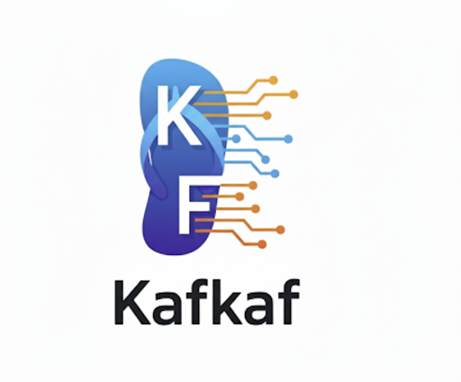

 

> ## 🚧 **Status: Draft – This project is in early development and not production-ready.**

# Kafkaf: A C\# Web UI for Apache Kafka

Kafkaf is an open-source, web-based UI for Apache Kafka, built from the ground up using **C\#** and the **Angular** framework. It's designed to be a secure, native .NET alternative to existing Kafka UIs.

## About the Project

This project was inspired by and aims to replicate the robust functionality of [provectus/kafka-ui](https://github.com/provectus/kafka-ui), but with a native .NET implementation.

-----

### Why Kafkaf?

1.  **Native .NET Experience:** Most popular Kafka UI projects are written in Java. Kafkaf offers a C\# alternative, making it more accessible and intuitive for the .NET community.
2.  **Focus on Security:** Kafkaf is intentionally designed with minimal third-party library dependencies to help streamline security audits and reduce potential vulnerabilities. It primarily relies on `Confluent.Kafka` and Bootstrap.

-----

## Current Status & Roadmap

This project is currently in the early development stages. The immediate goal is to implement features similar to those found in `provectus/kafka-ui`. Future development will be guided by community feedback and contributions.

## Origin of the Name

I like this project so much, I named it twice.

## License

This project is licensed under the Apache 2.0 License. See the [LICENSE.txt](https://www.google.com/search?q=./LICENSE.txt) file for details.
