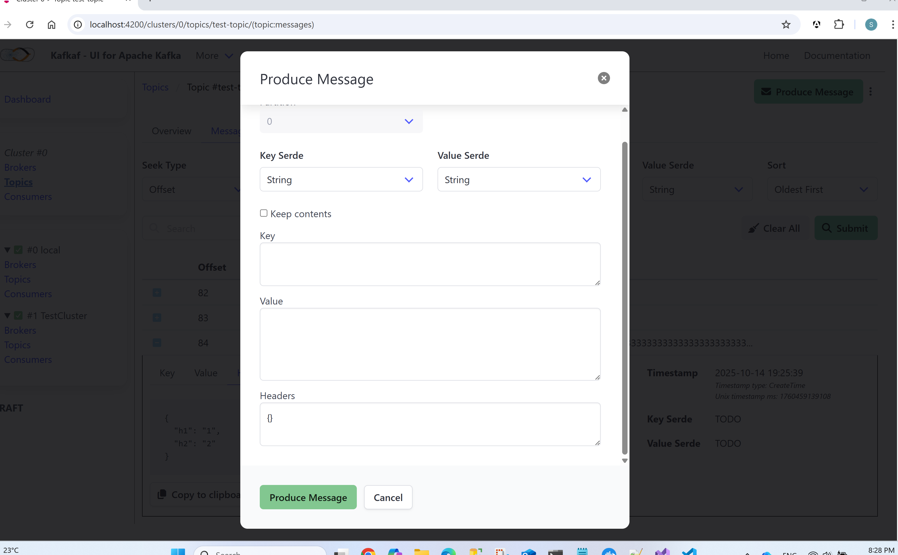

> ## 🚧 **Status: Early Development (Draft)**
> **This project is under active development and is not yet ready for production environments.**

# Kafkaf: A C\# Web UI for Apache Kafka

**Kafkaf** is an open-source, web-based User Interface (UI) for managing and monitoring Apache Kafka clusters. It is engineered from the ground up using **C\# (.NET)** for the backend and **Angular** for the frontend, providing a native, modern, and security-focused alternative to existing Kafka UIs.

## About the Project

### The Real-World Motivation: Why Kafkaf Exists

The genesis of this project was a direct response to a real-world security challenge. While seeking a suitable Kafka UI for an enterprise environment, a popular choice, `provectus/kafka-ui`, could not pass stringent internal security scans primarily due to its extensive list of third-party dependencies.

**Kafkaf** was therefore inspired by the robust feature set of [provectus/kafka-ui](https://github.com/provectus/kafka-ui), but with a core mission: **to provide similar functionality while drastically minimizing third-party library dependencies.** This intentional design choice helps streamline security audits and provides greater independence from external vulnerabilities.

---

### Key Differentiators

1.  **Focus on Security & Audibility:** By intentionally limiting third-party libraries, Kafkaf significantly reduces the project's attack surface and simplifies the process of security vetting and auditing. The project's dependencies are intentionally minimal, centered around the trusted **`Confluent.Kafka`** NuGet package, **Angular**, and the lightweight **Bulma CSS** framework.
2.  **Native .NET Experience:** Most popular Kafka UI projects are built on the JVM (Java/Scala). Kafkaf offers a cohesive and intuitive **C\# (.NET)** alternative, making it the ideal choice for organizations and developers standardized on the Microsoft technology stack.

---

### The Journey to Feature Parity

`provectus/kafka-ui` is a mature, comprehensive project with a vast feature set developed over many years. As **Kafkaf** is a **newly initiated, draft-status** project, achieving full feature parity will be a long-term, incremental journey. Our immediate focus is on building a secure, stable core with essential functionality, and we will prioritize advanced features based on community demand and contributions.

---

## Current Status & Roadmap

This project is currently in the **early development stages**. The immediate goal is to implement a core set of features mirroring those found in `provectus/kafka-ui`.

For a detailed list of planned features, milestones, and development priorities, please see the **[Full Project Roadmap](./ROADMAP.md)**.

## Origin of the Name

I like this project so much, I named it twice.

## Screenshots

### Messages List
***

### Create Message Modal
***

### Topics List
***

## License

This project is licensed under the **Apache 2.0 License**. See the included [`LICENSE`](./LICENSE) file for full details.